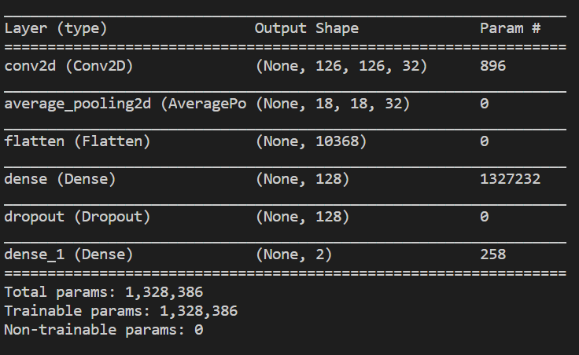

# face-mask-and-social-distance-detection
Utilize Deep Learning model to detect face masks and social distance violation (Estimate).

Scoail Distance calculated based on X and Y distance between objects. Each object is represented by a vector (x, y) to be used to calculate using Euclidean distance. Euclidean distance calculation concept as follows: 
1. Subtract both vectors x and y
2. Square root of the difference
3. Add both square roots
4. Take square root of the addition in previous step

In-case of social distance violation the violatee's rectangales are colored red.

Deep Learning Model

